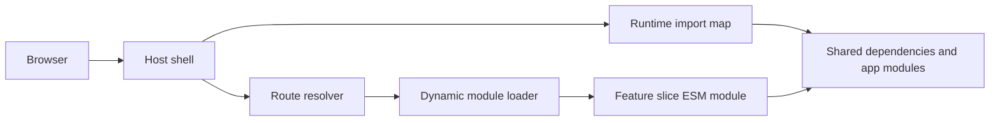

# Runtime Module Composition

Runtime Module Composition is a browser-native micro frontend strategy for composing independently built and deployed JavaScript modules at runtime. Instead of producing one application bundle, a host shell loads a shared import map, resolves route ownership, and dynamically imports the frontend module responsible for the current user journey.

This document describes the technical implementation pattern used by Ferry RSVP and generalizes it into a reusable architecture.

## Goals

- Compose independently deployed frontend slices into one product experience.
- Keep shared runtime dependencies centralized and versioned in one import map.
- Preserve native ESM semantics in development and production.
- Allow each product slice to build, test, and deploy independently.
- Avoid duplicating framework dependencies such as React, routing, state, and UI libraries across slices.
- Keep local development close to production behavior.

## Core Idea

Runtime Module Composition has four moving parts:

1. A host shell owns the document, root React tree, global routing context, theme providers, navigation, and footer.
2. An import map defines where bare module specifiers resolve at runtime.
3. Feature slices build ESM outputs, usually as `*.mjs` files, and publish them to a static asset origin.
4. A runtime loader maps the current route to a module specifier and imports it dynamically.

The result is one user-facing application made from many independently owned modules.



## Runtime Request Flow

1. The browser requests the host application HTML.
2. The host HTML loads the import map script before the application entry module.
3. The import map registers shared dependency URLs and application module prefixes.
4. The host application boots its root providers: router, theme, locale, navigation, and shell layout.
5. The current route is converted into a module specifier.
6. The dynamic loader imports the resolved module specifier.
7. The browser resolves that specifier through the import map.
8. The remote ESM module is fetched, evaluated, and rendered inside the shell.

## Import Map Ownership

The import map is the runtime contract between independently deployed modules. It should be treated as product infrastructure, not as a convenience file.

It owns:

- framework versions, such as React and React DOM;
- shared state and routing dependencies;
- design system and UI package URLs;
- internal app module prefixes;
- static asset origins;
- exact-version dependency pinning;
- environment-specific URL behavior, such as development flags.

Example shape:

```js
{
  "imports": {
    "@esm.sh/react": "https://esm.sh/react@19.2.4",
    "@esm.sh/react-dom/client": "https://esm.sh/react-dom@19.2.4/client",
    "@ferryrsvp/web-runtime": "https://assets.ferry.rsvp/web-runtime/index.mjs",
    "@ferryrsvp/web-ui": "https://assets.ferry.rsvp/web-ui/index.mjs",
    "@ferryrsvp/booking/": "https://assets.ferry.rsvp/web-booking/"
  }
}
```

This allows a slice to import shared dependencies with stable bare specifiers:

```js
import React from "@esm.sh/react";
import { createRoot } from "@esm.sh/react-dom/client";
import { useTranslate } from "@ferryrsvp/web-runtime";
```

The slice does not need to bundle these runtime dependencies. The browser resolves them from the shared import map.

## Host Shell Responsibilities

The host shell should stay thin but decisive. It owns the application frame and the runtime composition boundary.

Host responsibilities:

- serve the HTML document;
- load the import map before module execution;
- bootstrap the root application;
- initialize global providers;
- normalize locale-aware paths;
- own global navigation and persistent layout;
- resolve URLs to slice module specifiers;
- render loading and error boundaries around remote modules.

The host should not own feature-specific UI or business workflows. Those belong in slices.

## Route-to-Module Resolution

Runtime Module Composition needs a deterministic way to decide which slice owns a route.

One practical pattern is namespace-based routing:

| Route prefix | Module specifier |
| --- | --- |
| `/page/...` | `@ferryrsvp/web-page/index.mjs` |
| `/search/...` | `@ferryrsvp/web-search/index.mjs` |
| `/booking/...` | `@ferryrsvp/web-booking/index.mjs` |
| `/tickets/...` | `@ferryrsvp/web-tickets/index.mjs` |

The route resolver should be small, predictable, and tested. It is part of the runtime contract.

Example:

```ts
export const getImportPath = ({ path, source }) => {
  const [namespace = "page"] = path.split("/").filter(Boolean);

  if (source === "local") {
    return "../src/index";
  }

  return `@ferryrsvp/web-${namespace}/index.mjs`;
};
```

Production and local development can use the same resolver while returning different module specifiers.

## Dynamic Module Loading

The dynamic loader imports the resolved module specifier and renders the default export.

Important loader behavior:

- use `import()` so slices are fetched on demand;
- preserve the module specifier so the import map can resolve it;
- use an error boundary for failed remote modules;
- show a lightweight loading state during fetch and evaluation;
- key the loaded module by resolved module path so route changes remount correctly when needed.

Example:

```jsx
const DynamicModuleLoader = ({ modulePath }) => {
  if (!modulePath) return null;

  const DynamicModule = React.lazy(async () => {
    return import(/* @vite-ignore */ modulePath);
  });

  return (
    <React.Suspense fallback={<LoadingState />}>
      <ErrorBoundary fallback={<NotFound modulePath={modulePath} />}>
        <DynamicModule />
      </ErrorBoundary>
    </React.Suspense>
  );
};
```

The `@vite-ignore` comment is important when using Vite because the module specifier is intentionally resolved by the browser import map at runtime.

## Slice Responsibilities

A slice is an independently owned frontend module. It should expose a stable entry point and assume the host provides global composition context.

Slice responsibilities:

- own feature-specific UI and state;
- publish ESM outputs;
- externalize shared runtime dependencies;
- avoid shipping duplicate React or shared UI libraries;
- integrate with shared runtime utilities through import-map specifiers;
- provide local development entry points;
- keep its public module entry stable.

Slices should not:

- mutate the global import map;
- bootstrap a second application root in production;
- bundle shared runtime dependencies already owned by the import map;
- assume they are the only application on the page.

## Build Configuration

Each slice should build as an ESM library.

Typical Vite production build:

```js
export default defineConfig({
  build: {
    outDir: "build/web-search",
    lib: {
      entry: ["src/index.tsx"],
      formats: ["es"],
      fileName: (_, entryName) => `${entryName}.mjs`
    },
    rollupOptions: {
      external: isExternal
    }
  }
});
```

The externalization rule is what keeps shared dependencies out of the slice bundle:

```js
export const isExternal = (moduleName) => {
  return [
    /^@esm\.sh/,
    /^@ferryrsvp/
  ].some((pattern) => pattern.test(moduleName));
};
```

In Ferry RSVP, this behavior is centralized in shared tooling so slices do not invent their own dependency policy.

## Dependency Policy

Runtime dependencies belong in the import map, not in each slice package.

Correct:

```js
import { create } from "@esm.sh/zustand";
import { Theme } from "@esm.sh/@radix-ui/themes";
```

Incorrect:

```json
{
  "dependencies": {
    "zustand": "^4.3.0",
    "@radix-ui/themes": "^3.0.0"
  }
}
```

Individual packages may still own development dependencies such as Vite, TypeScript, test tools, and deployment tooling.

## Local Development

Local development should preserve the same architecture:

- use the same host HTML template;
- inject the import map before local entry modules;
- externalize import-map-owned dependencies in Vite;
- allow local source entry points for the active slice;
- use development import-map URLs when needed.

This keeps the feedback loop fast while still testing the runtime composition model.

## Deployment Model

Each slice deploys static ESM assets to a stable asset origin.

Recommended deployment flow:

1. Build the slice as ESM.
2. Upload the build output to a versioned or stable asset path.
3. Update the import map when a public module URL changes.
4. Deploy the import map.
5. Deploy or invalidate the host shell if the composition contract changed.

For low-risk updates, a slice can often deploy independently if its public entry point remains stable.

## Versioning Strategy

The import map is the coordination point for versions.

Use exact versions for core framework dependencies. Avoid unpinned `latest` URLs for critical runtime libraries because independently deployed slices need deterministic behavior.

Recommended rules:

- pin React, React DOM, router, state, and UI libraries;
- review import map changes like application infrastructure changes;
- test host and affected slices together when shared dependency versions change;
- keep rollback simple by preserving previous import map versions or asset paths.

## Failure Modes

Common failure modes and mitigations:

| Failure | Cause | Mitigation |
| --- | --- | --- |
| Remote module fails to load | Missing asset, bad import-map URL, CDN issue | Error boundary, asset health checks, rollback import map |
| Duplicate React instance | Slice bundled React instead of externalizing it | Shared externalization helper and build checks |
| Route loads wrong slice | Resolver rule drift | Unit tests for route-to-module mapping |
| Local dev differs from production | Dev server rewrites bare imports | Import-map-aware Vite plugin and externalization |
| Breaking shared dependency upgrade | Import map changed without slice compatibility checks | Cross-slice smoke tests before release |

## Operational Checklist

Before adding a new slice:

- define its route namespace;
- add or confirm its import-map prefix;
- expose a stable ESM entry point;
- externalize import-map-owned dependencies;
- add a local development entry point;
- add route resolver tests;
- verify host loading, loading state, and error state;
- document ownership and deployment path.

Before changing a shared dependency:

- update the import map;
- confirm externalization still matches the import-map specifier;
- build affected slices;
- smoke test host navigation across affected routes;
- prepare rollback to the previous import map.

## Why This Strategy Works

Runtime Module Composition keeps the browser as the composition runtime. The host shell provides the stable product frame. The import map provides the dependency and module resolution contract. Slices remain independently owned and deployed, but they render as one coherent application because they share the same runtime graph.

The strategy is deliberately small: standard ESM, standard import maps, static assets, and dynamic imports. That makes it understandable, portable, and operationally friendly.

